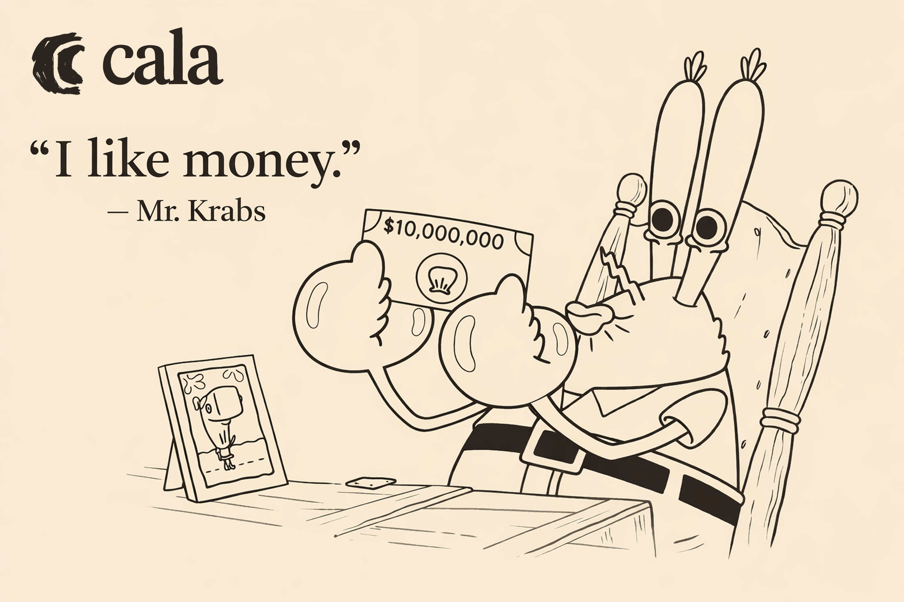

# mrkrabs

<p align="center">
  
</p>

An AI agent that builds a $1,000,000 NASDAQ portfolio for Cala's "Lobster of Wall Street" challenge at the Project Barcelona hackathon — with an autoresearch loop that self-improves the stock picking strategy and explains every pick with verified data from Cala's knowledge graph.

## Demo

<div>
  <a href="https://www.loom.com/share/1c5825e960bd474796db6931003fb96e">
    <p>Building an AI Agent for Investment Portfolios - Watch Video</p>
  </a>
  <a href="https://www.loom.com/share/1c5825e960bd474796db6931003fb96e">
    
  </a>
</div>

## The challenge

Turn the clock back 365 days — it's April 15th 2025. You have $1,000,000 and access to Cala's verified-knowledge API. Build an agent that researches NASDAQ-listed companies and allocates that capital across **at least 50 stocks**. One year later (today, 2026-04-15) the portfolio is scored on real market data and ranked on a live leaderboard.

**Hard constraints:** ≥50 NASDAQ tickers, ≥$5k per position, $1M total exactly, no post-cutoff data.

## What we built

### The agent

- **Single-thesis investing**: favor companies with low or improving legal-entity complexity — fewer subsidiaries, fewer jurisdictions, shallower ownership chains = more focused, operationally efficient businesses.
- **Powered by Cala**: every company is resolved via Cala's entity graph. The agent calls `entity_search`, `entity_introspection`, and `retrieve_entity` to extract filing-linked subsidiary counts, jurisdiction spread, hierarchy depth, and complexity scores — all grounded in pre-cutoff SEC filings.
- **Structured output**: the agent produces a full portfolio with per-position thesis, Cala evidence, risk notes, cutoff compliance, and a narrative report with inline entity citations.

### Autoresearch

An outer loop that **self-improves** the agent's strategy:

1. Run the agent with the current champion system prompt
2. Submit the portfolio to the leaderboard
3. Ask a mutator LLM to propose one new strategy rule based on score history
4. If the new score beats the champion — keep the rule; otherwise discard it
5. Repeat

Each iteration's proposed rule, verdict (kept/discarded/skipped), and skip reason are fed back to the mutator so it learns from failures. The agent retries on validation errors (up to 2 attempts) instead of wasting the whole iteration.

### The dashboard

A monochrome Next.js dashboard built for the judges:

- **Evidence tab**: every portfolio position expands to show live Cala entity data — company profile, relationships, knowledge, explainability — fetched in real time from the Cala API
- **Ontology panel**: "Why these 50 companies?" — cards for each pick with the investment thesis, Cala-sourced structure metrics, and an expandable deep-dive into the entity graph
- **Per-position explainability**: complexity metrics, filing dates, Cala evidence list, risk notes, cutoff compliance — all structured, not just a wall of text
- **Report renderer**: markdown narrative with inline entity pills that link back to Cala tool calls
- **Autoresearch view**: score trend charts, mutation history, session controls (shrink iterations on the fly), prior-iteration context on every run detail

## Team

- **Pau** ([@PauAbellaMolina](https://github.com/PauAbellaMolina)) — frontend, infra, evidence UI
- **Anton** ([@AntonWiklund1](https://github.com/AntonWiklund1)) — agent, strategy, Cala integration

## Stack

- **Next.js 16** (App Router, Turbopack) + TypeScript
- **Vercel AI SDK** (`ai`, `@ai-sdk/anthropic`) — agent loop with tool-calling
- **Cala API + MCP** — verified entity graph, knowledge search, explainability
- **Convex** — real-time backend for run state, autoresearch ledger, session management
- **Tailwind v4** — monochrome design system with OKLCH colors

## Getting started

```bash
pnpm install
cp .env.local.example .env.local   # fill in CALA_API_KEY + ANTHROPIC_API_KEY
pnpm dev
```

Open http://localhost:3000.

## Docs

- [`docs/VISION.md`](./docs/VISION.md) — what we're building and why
- [`docs/PRD.md`](./docs/PRD.md) — product requirements
- [`docs/STRATEGY.md`](./docs/STRATEGY.md) — trading thesis + complexity signals
- [`docs/NOTES.md`](./docs/NOTES.md) — running decisions + scratchpad
- [`docs/LEADERBOARD.md`](./docs/LEADERBOARD.md) — submission API + scoring rules
